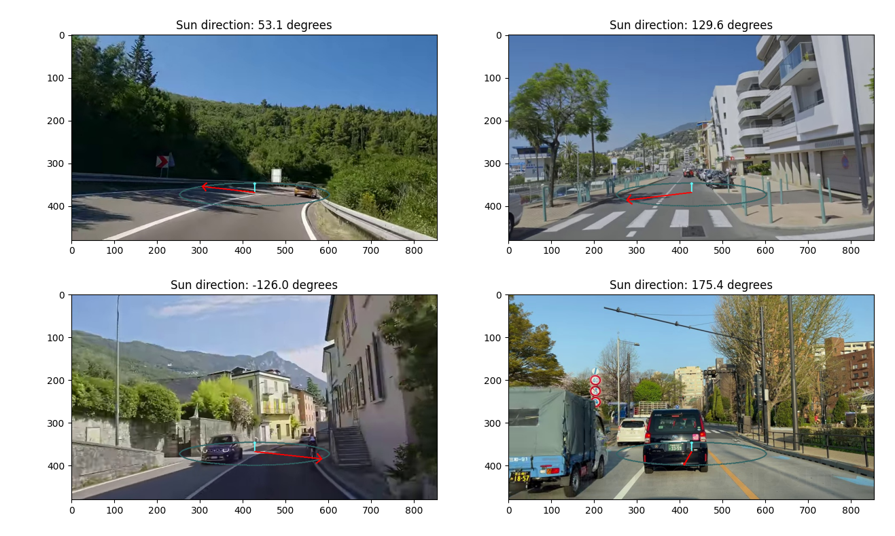

# Suncompass

This repository contains code for estimating the direction of the sun from a single outdoor image.


## Why?

In many areas of the world the sun shines a lot and humans have used it as a navigational aid for thousands of years. So maybe it would be fun to imbue our robotic creations with this ability too.

Applications:
- You can estimate the yaw angle between multiple cameras on the same rig even if they don't have overlap
- You can stabilise SLAM algorithms by adding an absolute yaw reference
- If you know the time, you know which way the sun is relative to you, and you have a reasonable estimate of where in the world you are then you can tell global heading

### What happens when the sun isn't shining?
The algorithm doesn't work 🤷‍♂️

## Repository Contents

1. **pretrained_resnet.py**: Defines a regression model based on a pre-trained ResNet model and includes functions for training and loading the model.
2. **3_224_224_resnet.pth**: A pre-trained ResNet model for estimating the direction of the sun from a single outdoor image.
3. **suncompass.py**: Class for interacting with the pre-trained ResNet model.
4. **demo.py**: Demonstrates how to use the pre-trained ResNet model to estimate the direction of the sun from a single outdoor image.

## Installation

### From pypi
```sh
pip install suncompass
```

### Manual installation

1. Clone the repository:
    ```sh
    git clone https://github.com/hugohadfield/suncompass.git
    cd suncompass
    ```

2. Install the package:
    ```sh
    pip install .
    ```

## Example usage

```python
import numpy as np
import cv2
import matplotlib.pyplot as plt

from suncompass import SunCompass

image_path = "croatia.jpg"
suncompass = SunCompass()
suncompass.set_eval(dropout=False)

image = cv2.imread(image_path)
img_with_suncompass, theta_rad = suncompass.predict_and_draw(image)
plt.figure()
plt.imshow(cv2.cvtColor(img_with_suncompass, cv2.COLOR_BGR2RGB))
plt.title(f"Sun direction: {np.degrees(theta_rad):.1f} degrees")
plt.show()
```


## Requirements

- Python 3.7+
- PyTorch
- torchvision
- pandas
- numpy
- matplotlib
- tqdm
- click
- PIL
- tensorboard
- suncalc

## Usage

### add_sun_vector.py

This script calculates the sun vector in the ENU frame and the relative frame based on heading.

Example usage:
```sh
python add_sun_vector.py
```

### extract_motion.py

This script extracts motion parameters such as speed, heading, and curvature from a given dataset.

Example usage:
```sh
python extract_motion.py
```

### pretrained_resnet.py

This script defines and trains a regression model based on a pre-trained ResNet model.

Example usage:
```sh
python pretrained_resnet.py
```

### run_model_on_images.py

This script runs the trained ResNet model on a set of images and saves the results to a CSV file.

Example usage:
```sh
python run_model_on_images.py --model_name 3_224_224_resnet.pth --image_dir /path/to/images --gt_csv /path/to/ground_truth.csv
```

## Function Details

### add_sun_vector.py

- `calculate_sun_vector_ENU(time: datetime, lat_degs: float, long_degs: float) -> np.ndarray`: Calculates the sun vector in the ENU frame.
- `calculate_sun_vector_relative(time_unixus: int, lat_degs: float, long_degs: float, heading_rads_from_east: Union[float, np.complex128]) -> np.ndarray`: Calculates the sun vector in the relative frame.
- `calculate_relative_azimuth_angle(time_unixus: int, lat_degs: float, long_degs: float, heading_rads_from_east: float) -> float`: Calculates the azimuth angle of the sun vector in the relative frame.

### extract_motion.py

- `haversine(lat1, lon1, lat2, lon2) -> float`: Calculates the great circle distance between two points on the Earth.
- `calculate_bearing_clockwise_from_north(lat1, lon1, lat2, lon2) -> float`: Calculates the bearing between two points.
- `calculate_heading_anticlockwise_from_east(lat1, lon1, lat2, lon2) -> float`: Calculates the heading anti-clockwise from east.
- `extract_motion(data: pd.DataFrame) -> pd.DataFrame`: Extracts speed, heading, and curvature from the given data.

### pretrained_resnet.py

- `ResNetRegression`: Defines a regression model based on a pre-trained ResNet model.
- `train_network(device, n_epochs: int = 10, image_size: Tuple[int, int] = (128, 128))`: Trains the network for a set number of epochs.

### run_model_on_images.py

- `run_model_on_images(model_name: Path, image_dir: Path, image_size: Tuple[int, int, int] = (1, 100, 100))`: Runs the model on the images and saves the results to a CSV file.
- `plot_results_csv(gt_csv: Optional[str] = None)`: Plots the results from the CSV file.

## License

This project is licensed under the MIT License - see the [licence.txt](licence.txt) file for details.
